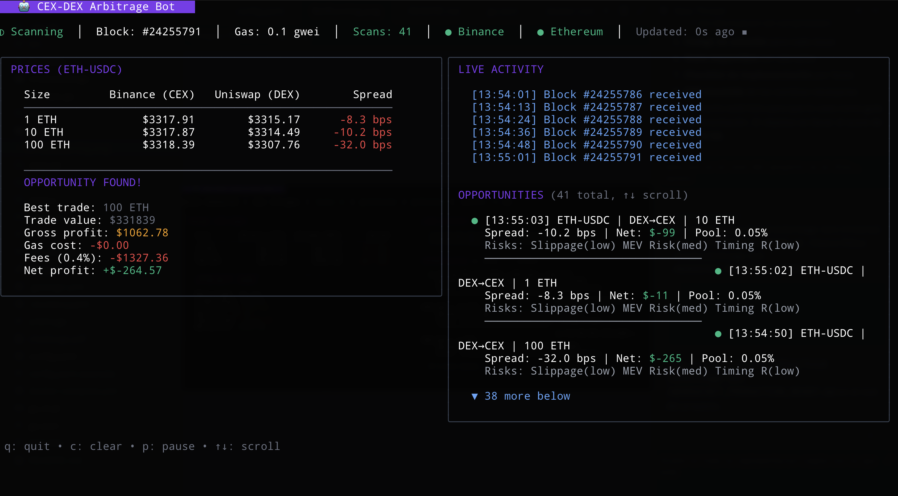

# CEX-DEX Arbitrage Bot

A real-time arbitrage opportunity detector that monitors price spreads between centralized exchanges (Binance) and decentralized exchanges (Uniswap V3) on Ethereum.



## Features

- **Real-time price monitoring**: WebSocket connections to Binance and Ethereum nodes
- **HTTP fallback**: Automatic REST API fallback when WebSocket data is stale or unavailable
- **VWAP calculation**: Volume-weighted average price for accurate large trade pricing
- **Multi-size analysis**: Analyzes opportunities for different trade sizes (1, 10, 100 ETH)
- **Cost-aware**: Includes gas costs and exchange fees in profit calculations
- **Execution planning**: Generates step-by-step execution plans for each opportunity
- **Risk assessment**: Identifies risk factors (slippage, MEV, timing) with severity levels
- **Pool fee detection**: Automatically selects best Uniswap V3 fee tier (0.01%, 0.05%, 0.30%, 1%)
- **Production-ready**: OpenTelemetry tracing, Prometheus metrics, structured logging
- **TUI interface**: Beautiful terminal UI with Bubble Tea showing prices, costs, and opportunities

## Architecture

The bot follows a hexagonal (ports & adapters) architecture with domain-driven design principles.

```
┌─────────────────────────────────────────────────────────────────┐
│                     CEX-DEX ARBITRAGE BOT                       │
├─────────────────────────────────────────────────────────────────┤
│  EXTERNAL SOURCES                                               │
│  ┌──────────┐  ┌──────────┐  ┌──────────┐                       │
│  │ Binance  │  │ Ethereum │  │ Uniswap  │                       │
│  │ WS + HTTP│  │ WebSocket│  │ Quoter   │                       │
│  └────┬─────┘  └────┬─────┘  └────┬─────┘                       │
│       │             │             │                             │
│       ▼             ▼             ▼                             │
│  ┌─────────────────────────────────────────────────────────┐    │
│  │              INFRASTRUCTURE LAYER                       │    │
│  │  wsconn │ httpclient │ Binance │ Uniswap │ Ethereum     │    │
│  └─────────────────────────────────────────────────────────┘    │
│                          │                                      │
│                          ▼                                      │
│  ┌─────────────────────────────────────────────────────────┐    │
│  │              APPLICATION LAYER                           │   │
│  │  Pricing Service │ Arbitrage Detector │ Profit Calculator│   │
│  └─────────────────────────────────────────────────────────┘    │
│                          │                                      │
│                          ▼                                      │
│  ┌─────────────────────────────────────────────────────────┐    │
│  │              PRESENTATION LAYER                         │    │
│  │         TUI (Bubble Tea)  │  CLI (debug logs)           │    │
│  └─────────────────────────────────────────────────────────┘    │
└─────────────────────────────────────────────────────────────────┘
```

For detailed documentation see:
- [Architecture](docs/architecture.md) - System design and module structure
- [Data Flow](docs/dataflow.md) - How data flows through the system

## Quick Start

### Prerequisites

- Go 1.21+
- Ethereum RPC endpoint (Infura, Alchemy, etc.)

### Environment Variables

Create a `.env` file:

```bash
# Required
INFURA_API_KEY=your_infura_key_here

# Optional (for telemetry)
OTEL_EXPORTER_OTLP_ENDPOINT=http://localhost:4317
OTEL_SERVICE_NAME=arbitrage-bot
```

### Running

```bash
# Build
go build -o arbitrage ./cmd/arbitrage

# Run with TUI (default)
./arbitrage

# Run with CLI mode (debug logs)
./arbitrage --cli

# Run with custom config
./arbitrage --config /path/to/config.yaml
```

### Sample Output (CLI Mode)

When an opportunity is detected, the bot outputs detailed analysis:

```
================================================================================
ARBITRAGE OPPORTUNITY DETECTED
================================================================================
Block:          #21234567
Timestamp:      2026-01-17T10:30:45Z
Pair:           ETH-USDC
Direction:      CEX → DEX (Buy on Binance, Sell on Uniswap)
--------------------------------------------------------------------------------
PRICES
  CEX (Binance):  $3,245.30
  DEX (Uniswap):  $3,268.75
  Spread:         72.15 bps
  Pool Fee Tier:  0.30%
--------------------------------------------------------------------------------
TRADE DETAILS
  Size:           10.0000 ETH
  Gas Cost:       0.005432 ETH ($17.64)
  Required Capital: $32,453.00
--------------------------------------------------------------------------------
PROFIT
  Gross:          $234.50
  Net:            $112.15 (47.81%)
--------------------------------------------------------------------------------
EXECUTION STEPS
  1. Buy 10.0000 ETH on Binance at $3,245.30
  2. Transfer ETH to trading wallet
  3. Execute Uniswap V3 swap: ETH → USDC via 0.30% pool
  4. Receive ~32,687.50 USDC from swap
  5. Transfer USDC back to Binance for next cycle
--------------------------------------------------------------------------------
RISK FACTORS
  - Slippage Risk (low): Price movement during execution
  - MEV Risk (medium): Potential sandwich attacks from MEV bots
  - Timing Risk (low): Block confirmation delays
================================================================================
```

### Configuration

See `config.yaml.example` for all options:

```yaml
arbitrage:
  pairs:
    - base: "ETH"
      quote: "USDC"
  trade_sizes: [1, 10, 100]  # ETH amounts to analyze
  min_profit_bps: 10         # Minimum spread in basis points
  min_profit_usd: 50         # Minimum profit in USD

binance:
  depth_speed_ms: 100        # Orderbook update speed (100 or 1000)
  enable_fallback: true      # Enable HTTP fallback when WS stale (default: true)
  stale_timeout: 5s          # Time before data is considered stale
```

## Useful Commands

```bash
# Build
go build ./cmd/arbitrage

# Run tests
go test ./...

# Run tests with race detector
go test -race ./...

# Run specific package tests
go test -v ./internal/wsconn/...

# Health check (when running)
curl http://localhost:8081/health

# Prometheus metrics
curl http://localhost:9090/metrics

# Lint
golangci-lint run
```

## Observability

### Metrics (Prometheus)

The bot exposes metrics on `:9090/metrics`. Key metrics:

| Metric | Description |
|--------|-------------|
| `binance_messages_total` | Total WebSocket messages received |
| `binance_depth_updates_total` | Orderbook depth updates |
| `http_client_requests_total` | HTTP fallback requests (labels: provider, success, endpoint) |
| `ws_connection_state` | WebSocket state (0=disconnected, 2=connected) |
| `ws_messages_dropped_total` | Messages dropped due to buffer full |
| `ws_pings_total` | Successful ping/pong heartbeats |
| `gas_price_gwei` | Current gas price |

**Useful PromQL queries:**

```promql
# Message rate per second
rate(binance_messages_total[1m])

# Dropped messages (should be 0)
increase(ws_messages_dropped_total[5m])

# Connection uptime
ws_connection_state == 2

# HTTP fallback usage (should be low)
rate(http_client_requests_total{provider="binance"}[5m])

# P95 message latency
histogram_quantile(0.95, rate(ws_message_latency_ms_milliseconds_bucket[5m]))
```

### Tracing (OpenTelemetry)

Enable OTLP exporter in config:

```yaml
telemetry:
  enabled: true
  otlp_endpoint: "http://localhost:4317"
```

**Useful trace queries (Jaeger/Tempo):**

```
# All arbitrage detection spans
service.name="arbitrage-bot" AND operation="arbitrage.detect"

# Slow Uniswap quotes (>200ms)
service.name="arbitrage-bot" AND operation="uniswap.quote" AND duration>200ms

# WebSocket reconnection events
service.name="arbitrage-bot" AND operation="ws.reconnect"
```

### Grafana Dashboard

Import the dashboard from `observability/grafana/arbitrage-bot.json` or create panels for:

1. **Connection Status**: `ws_connection_state`
2. **Message Throughput**: `rate(binance_messages_total[1m])`
3. **Dropped Messages**: `ws_messages_dropped_total`
4. **Gas Price**: `gas_price_gwei`
5. **Latency Histogram**: `ws_message_latency_ms_milliseconds`

## Domain Decisions

### Why Block-Triggered Analysis?

Instead of continuously polling prices, we trigger analysis on new Ethereum blocks (~12s). This ensures:
- DEX prices are fresh (Uniswap state changes per block)
- Reduced RPC calls
- Natural rate limiting

### Why VWAP for CEX Prices?

Best bid/ask is insufficient for large trades. We maintain top 20 orderbook levels and calculate Volume-Weighted Average Price (VWAP) for accurate execution price estimates.

### Fee Assumptions

| Exchange | Fee |
|----------|-----|
| Uniswap V3 | 0.01% - 1% (auto-detected best pool) |
| Binance | 0.1% (taker) |

The bot automatically queries all Uniswap V3 fee tiers (0.01%, 0.05%, 0.30%, 1%) and selects the pool with best execution price. The selected pool fee tier is shown in opportunity reports.

Opportunities typically need >40-60 bps spread to overcome fees + gas, depending on pool fee tier.

### Why No Execution?

This bot is **detection-only**. Execution requires:
- Private key management
- MEV protection (Flashbots)
- Atomic execution (flash loans)
- Slippage protection

These are out of scope for this monitoring tool.

## Deployment

### Current: Single Binary

```bash
./arbitrage  # Runs detection + TUI in one process
```

### Future: Client-Server Architecture

The codebase is designed to eventually support a separated architecture:

```
┌─────────────────────────────────────────────────────────────┐
│                    DETECTION SERVER                         |
│  - Subscribes to blocks, fetches prices                     │
│  - Calculates opportunities                                 |
│  - Exposes API (HTTP/WebSocket/gRPC)                        │
│  - Prometheus metrics                                       |
└─────────────────────────────────────────────────────────────┘
                              │
                              │ API
                              ▼
┌─────────────────────────────────────────────────────────────┐
│                       CLIENTS                               │
│  - TUI (current)                                            │
│  - Web dashboard                                            │
│  - Mobile app                                               │
│  - Alerts/notifications                                     │
└─────────────────────────────────────────────────────────────┘
```

This separation is not yet implemented but the domain layer is decoupled to support it.

### Observability Stack (Docker Compose)

```bash
# Start observability stack
docker-compose up -d

# Services:
# - Zipkin:     http://localhost:9411  (tracing UI)
# - Prometheus: http://localhost:9091  (metrics)
# - Grafana:    http://localhost:3000  (dashboards, admin/admin)

# Run the bot
./arbitrage  # Exports metrics to :9090, traces to Zipkin
```

## License

MIT
